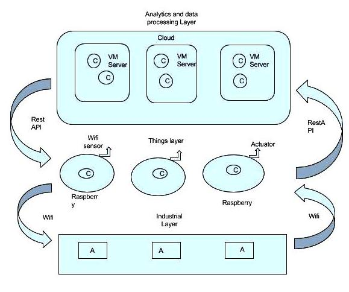

# Dockeriot

Dockeriot is an apps development platform for IOT devices using docker (and possibly kubernates!) 
Dockeriot aims to enable all the features of containers (in our case docker containers) for applications
under an Internet of things (IOT) environment. 

Applications of dockeriot include: 
* Testing and deploying of complex applications on many devices in a replicable and scalable way. 
* Fast integration of new features in a chain of devices allowing testing deploying and integration.
* Fast integration with distributed technologies like blockchain.

"Note": Although here we depict a general platform, the first layer that is developed is the "things layer"

## General scheme

* The C letters reffer to docker software containers.
* The A letter reffer to PLCs with Arduino and/or Raspberry nucleus.

## Things Layer
 

### Things layer zoom
#### App container

#### Sensor/Actuator container

## Industrial Layer

## Analitics Layer

### Install it!
* [Install](installation.md)

### Run it!

* See usage examples and applications

### Contact
* [Contact](dockeriot/CONTACT.md)

