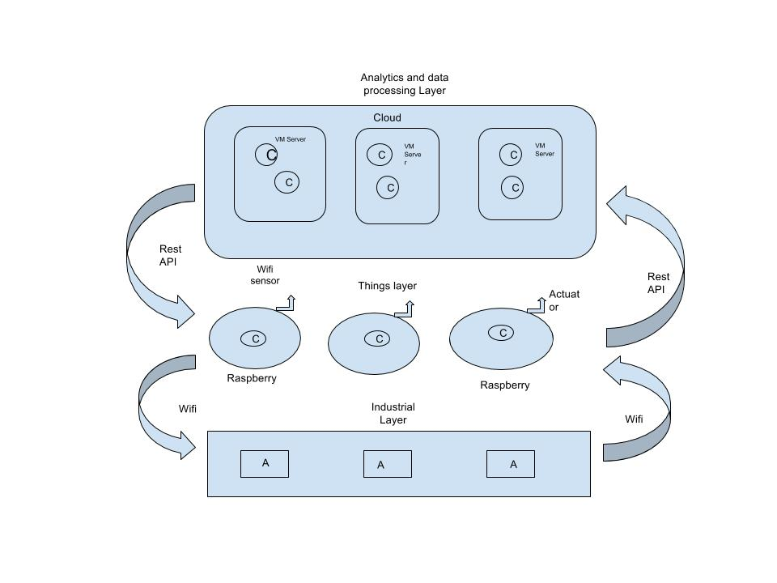

# Dockeriot

Dockeriot is an apps development platform for IOT devices using docker

Dockeriot aims to enable all the features of containers (in this case docker containers) for applications
under an Internet of things environment. 

Note: Although here we depict a general platform, the first layer that is developed is the "things layer"

## General scheme

* The C letters reffer to docker software containers.
* The A letter reffer to PLCs with Arduino and/or Raspberry nucleus.

## Things Layer
 

## Industrial Layer

## Analitycs Layer

