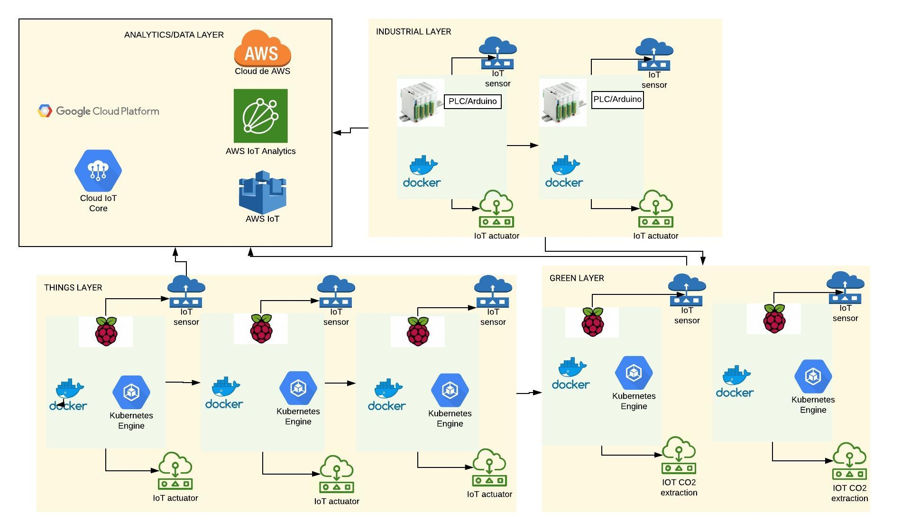

# Dockeriot

Dockeriot is an apps development platform for IOT devices using docker.
Dockeriot aims to enable all the features of containers for applications
under an Internet of things (IOT - cloud enabled) environment. If you want to see further and rapid developments on dockeriot please support us via  [Contact](CONTACT.md) or [Funding](.github/FUNDING.yml)

Applications of dockeriot include: 
* Testing and deploying of complex applications on many devices in a replicable and scalable way. 
* Fast integration of new features in a chain of devices allowing testing deploying and integration.
* Fast integration with distributed technologies like blockchain and other DLTs (f.e IOTA and HOLOchain)
* Support for SC on different chains. 

```Note: Although here we depict a general platform, the first layer that is developed is the:``` [Things Layer](ThingsLayer.md)

## General scheme
This scheme describes the basic components of dockeriot, each device f.e a raspberry board can have installed docker or kubernetes in which 
a full application can be defined abstracting de underlaying operative system. 




* The things and green layer can be implemented with other embedded platforms different than raspberry
* For more information on layers you can see: [Things Layer](ThingsLayer.md), [Industrial Layer](IndustrialLayer.md), [Analytics Layer](AnalyticsLayer.md), Green layer. 

## Next steps

* [Install](installation.md) it

* Run it: See [usages](USAGES.md) and applications


