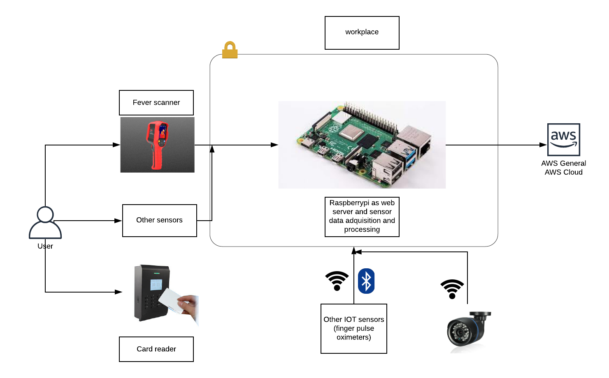

# Example applications and uses of dockeriot

Dockeriot can be applied to a wide range of IOT wide deployment scenarios and integrations 

* Testing applications at scale over IOT devices and networks.  
* Develop application that integrate and scale in million of devices under an IOT environment.
* Data adquisition arquitectures for IOT sensors. f.e: 

