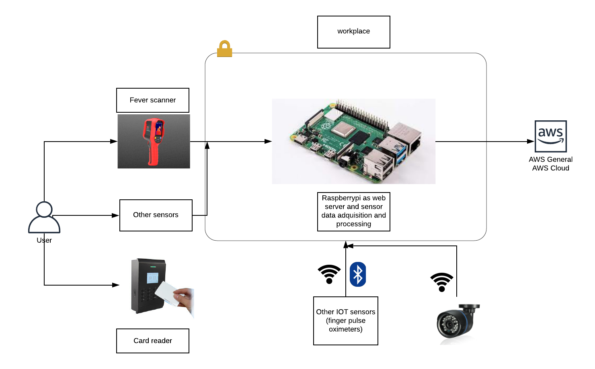

# Example applications and uses of dockeriot

Dockeriot can be applied to a wide range of IOT wide deployment scenarios and integrations 

* Testing applications at scale over IOT devices and networks.  
* Prototype and Develop applications that integrate and scale in million of devices under an IOT environment.
* Allow smart contracts in a network of blockchain soported data for IOT devices. 
* Incorporind DLT to the IOT space. 
* Data adquisition arquitectures for IOT sensors. f.e: 

